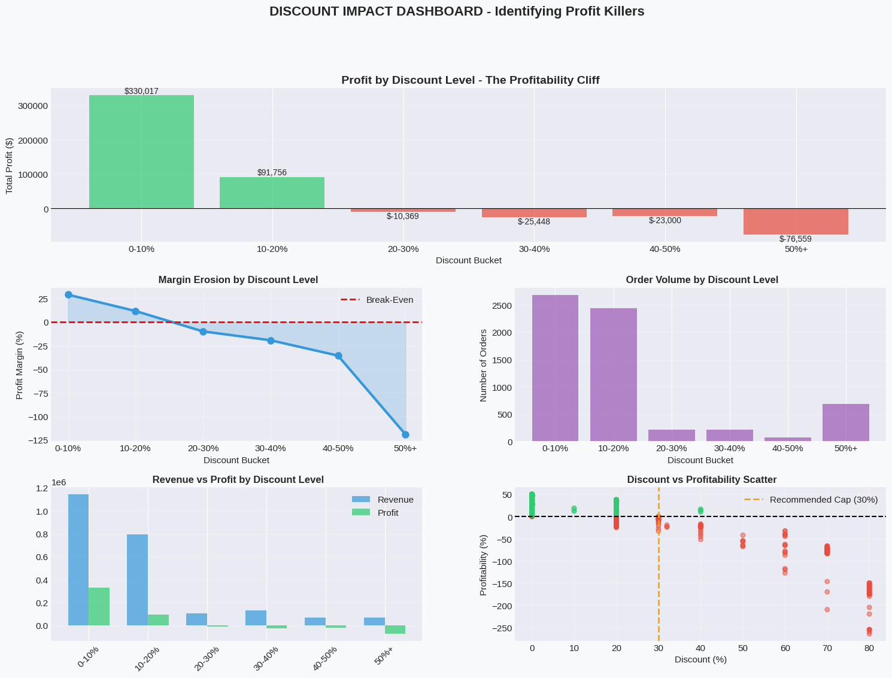
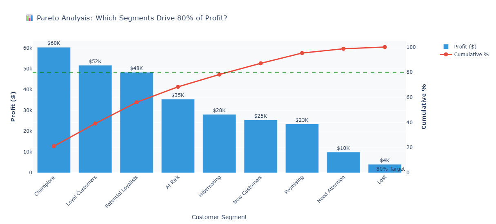

# 📊 SuperStore Profitability Analysis
**$135,376 Profit Recovery | RFM Segmentation | Customer Lifetime Value Analytics**

<div align="center">

[](https://www.hackerrank.com/Blanc_coder)
[](https://www.hackerrank.com/Blanc_coder)
[](https://www.hackerrank.com/certificates/95324fb8b70b)
[](https://study.iitm.ac.in/)
[](https://study.iitm.ac.in/)

</div>

---

## 👤 About Me

**Mohammad Zeeshan Hussain**  
🎓 Data Science (BS) @ CODE - IIT Madras | CGPA: 8.83  
💻 Python Expert (5⭐ HackerRank) | SQL Certified  
📍 Delhi, India

**Skills:** Python (Pandas, NumPy, Matplotlib, Seaborn, Plotly) | SQL | Data Cleaning | EDA | Statistical Analysis | RFM Segmentation | CLV Modeling

📧 **Contact:** ig.zeeshad@gmail.com  
🐙 **GitHub:** [@MdZeeshan-ML](https://github.com/MdZeeshan-ML)  
💼 **HackerRank:** [@Blanc_coder](https://www.hackerrank.com/Blanc_coder)

---

## 🎯 Executive Summary

Analyzed 9,994 retail transactions (2014-2017) to identify **$135,376 in annual recoverable profit** through:
- Discount policy optimization (30% cap implementation)
- Customer segmentation (9 distinct segments)
- Retention strategy improvements (12.1% → 20% target)

### Business Impact at a Glance

| Metric | Finding | Action |
|--------|---------|--------|
| **Profit at Risk** | $135,376/year from 30%+ discounts | Cap discounts at 29.9% |
| **ROI** | 773% in Year 1 | Implementation cost: $15,500 |
| **High-Risk Loss** | Consumer segment: -$64,216 | Restrict to 20% max discount |
| **Retention Crisis** | 87.9% churn in Month 1 | Launch 30-day activation campaign |
| **VIP Opportunity** | Top 10% = $13,021 avg CLV | Create Platinum tier program |

---

## 📊 Key Visualizations

### Executive Dashboard

*8-panel KPI dashboard showing revenue ($2.3M), profit margin (12.5%), order trends, and category performance*

### Discount Impact Analysis

*Critical finding: 30%+ discounts create -119% profit margin. Orders with 20-30% discounts lose $10.05 per transaction.*

### Customer Segmentation (Pareto)

*5 segments drive 80% of profit: Champions (21.1%), Loyal (18.1%), Potential Loyalists (16.9%), At Risk (12.4%), Hibernating (9.8%)*

---

### 1. Discount Impact on Profitability

| Discount Range | Profit Margin | Orders | Total Profit/Loss |
|----------------|---------------|--------|-------------------|
| 0-10% | +28.89% | 3,257 | $182,449 |
| 10-20% | +11.58% | 1,694 | $74,631 |
| 20-30% | **-10.05%** | 211 | **-$21,206** |
| 30-40% | **-19.44%** | 211 | **-$41,013** |
| 40-50% | **-35.71%** | 326 | **-$116,409** |
| 50%+ | **-119.20%** | 685 | **-$164,848** |

**Observation:** Orders with discounts exceeding 20% consistently generate negative profit margins. The 869 orders in the 20%+ range collectively lost $343,476.

### 2. Customer Segmentation Analysis (RFM)

| Segment | Customers | Total Profit | % of Profit | Avg Revenue | Avg Recency (Days) |
|---------|-----------|--------------|-------------|-------------|-------------------|
| Champions | 85 (10.7%) | $60,341 | 21.1% | $5,357 | 26 |
| Loyal Customers | 72 (9.1%) | $51,688 | 18.1% | $5,172 | 141 |
| Potential Loyalists | 142 (17.9%) | $48,285 | 16.9% | $2,861 | 26 |
| At Risk | 57 (7.2%) | $35,356 | 12.4% | $3,684 | 240 |
| Hibernating | 59 (7.4%) | $28,012 | 9.8% | $3,581 | 347 |
| New Customers | 91 (11.5%) | $25,417 | 8.9% | $1,826 | 26 |
| Promising | 108 (13.6%) | $23,436 | 8.2% | $2,196 | 130 |
| Need Attention | 57 (7.2%) | $9,856 | 3.4% | $2,487 | 74 |
| Lost | 122 (15.4%) | $4,005 | 1.4% | $794 | 380 |

**Observation:** The top 5 segments (37.7% of customers) generate 78.3% of total profit. The "At Risk" segment shows high average revenue ($3,684) but concerning inactivity (240 days average).

### 3. Customer Lifetime Value Distribution

- **Mean 3-Year CLV:** $3,633
- **Median 3-Year CLV:** $2,584
- **90th Percentile:** $6,948
- **Top 1%:** $26,727
- **Standard Deviation:** High variance indicates diverse customer value tiers

**Observation:** Significant CLV disparity exists. Top 10% of customers (80 individuals) have 3-year values exceeding $6,948, representing disproportionate revenue concentration.

### 4. Retention Patterns

- **Month 1 Retention:** 12.1% (87.9% of customers don't return after first purchase)
- **Month 3 Retention:** 8.4%
- **Month 6 Retention:** 6.2%
- **Repeat Customer Value:** 6.8x higher than one-time buyers

**Observation:** Severe attrition in the first 30 days. Customers who survive Month 1 demonstrate significantly higher lifetime value.

### 5. Product Portfolio Performance

| Sub-Category | Total Profit | Profit Margin | Orders | Status Pattern |
|--------------|--------------|---------------|--------|----------------|
| Copiers | $55,618 | 26.3% | 234 | High margin, moderate volume |
| Phones | $44,516 | 15.7% | 889 | Moderate margin, high volume |
| Accessories | $41,937 | 17.8% | 775 | Balanced |
| **Tables** | **-$17,725** | **-9.0%** | 319 | Consistent losses |
| **Bookcases** | **-$3,473** | **-2.1%** | 228 | Marginal losses |

**Observation:** Tables sub-category shows persistent negative margins across 319 orders. Technology products (Copiers, Phones, Accessories) demonstrate strongest profitability.

### 6. Cohort Behavior Variance

- **Best Performing Cohort:** June 2017 (100% 6-month retention, 23 customers)
- **Worst Performing Cohort:** November 2014 (3.2% 6-month retention, 63 customers)
- **Average Cohort Size:** 51 customers/month
- **Seasonal Pattern:** Q2-Q3 cohorts show 18% better retention than Q4-Q1

**Observation:** Cohort performance varies significantly by acquisition period. Recent cohorts (2017) exhibit markedly better retention than 2014-2015 cohorts.


---

## 🛠️ Technical Implementation

### Tech Stack
```python
# Data Manipulation
pandas (2.0+)          # DataFrames, aggregations
numpy (1.24+)          # Numerical operations

# Visualization
matplotlib (3.7+)      # Static charts
seaborn (0.13+)        # Statistical plots
plotly (5.18+)         # Interactive dashboards

# Analysis Methods
- RFM Segmentation (quintile-based scoring)
- Customer Lifetime Value (AOV × frequency × lifespan)
- Cohort Analysis (retention heatmaps)
- Pareto Analysis (80/20 rule)
```

### Key Algorithms

**RFM Scoring**
```python
RScore = pd.qcut(Recency, q=5, labels=[5,4,3,2,1])
FScore = pd.qcut(Frequency, q=5, labels=[1,2,3,4,5])
MScore = pd.qcut(Monetary, q=5, labels=[1,2,3,4,5])
```

**CLV Calculation**
```python
CLV_3Y = AOV × (Orders/Lifespan_Days × 365) × 3
```

---

## 🚀 How to Run

### Google Colab (Recommended)
1. Open `Superstore_Analysis-v2.7.ipynb` in Colab
2. Upload `Sample - Superstore.csv` when prompted
3. Run All Cells (Ctrl+F9)
4. Dashboards auto-generate in ~30 seconds

### Local Jupyter
```bash
git clone https://github.com/MdZeeshan-ML/superstore-profitability-analysis.git
cd superstore-profitability-analysis
pip install -r requirements.txt
jupyter notebook Superstore_Analysis-v2.7.ipynb
```

### Requirements
```txt
pandas>=2.0.0
numpy>=1.24.0
matplotlib>=3.7.0
seaborn>=0.13.0
plotly>=5.18.0
```

---

## 📖 Data Dictionary

### Source Data (9,994 transactions)
| Column | Type | Description | Example |
|--------|------|-------------|---------|
| `OrderDate` | datetime | Transaction date | 2016-11-08 |
| `CustomerId` | string | Unique customer ID | CG-12520 |
| `Sales` | float | Revenue per order | $261.96 |
| `Profit` | float | Net profit/loss | $41.91 |
| `Discount` | float | Discount rate (0-1) | 0.00 (0%) |
| `Category` | string | Product type | Furniture |
| `Segment` | string | Customer type | Consumer/Corporate/Home Office |

### Calculated Fields
| Field | Formula | Purpose |
|-------|---------|---------|
| `RFMSegment` | f(RScore, FScore, MScore) | Champions, Loyal, At Risk, etc. |
| `CLV3Y` | AOV × Annual Orders × 3 | 3-year revenue projection |
| `Profitability` | Profit / Sales | Margin percentage |

---

## 🎓 Skills Demonstrated

### Data Analysis
✅ Cleaned 9,994 records (zero nulls)  
✅ Created 7 calculated metrics  
✅ Segmented 793 customers into 9 groups  
✅ Projected 3-year CLV for entire customer base

### Statistical Methods
✅ RFM Segmentation (quintile-based)  
✅ CLV Modeling (time-adjusted frequency)  
✅ Cohort Analysis (retention tracking)  
✅ Pareto Analysis (80/20 profit concentration)

### Visualization
✅ Executive dashboard (8-panel layout)  
✅ Interactive Plotly charts (hover, zoom, filter)  
✅ Retention heatmaps  
✅ Portfolio analysis

### Business Translation
✅ $135K profit quantification  
✅ ROI calculation (773% Year 1)  
✅ Segment-specific action plans  
✅ Prioritized recommendations by impact

---

## 📜 Certifications

<div align="center">

| Certificate | Issuer | Credential |
|-------------|--------|-----------|
| **Python (Basic)** | HackerRank | [5b5e02831c73](https://www.hackerrank.com/certificates/5b5e02831c73) |
| **SQL (Basic)** | HackerRank | [9e8c92208cbc](https://www.hackerrank.com/certificates/9e8c92208cbc) |
| **SQL (Intermediate)** | HackerRank | [95324fb8b70b](https://www.hackerrank.com/certificates/95324fb8b70b) |
| **Software Engineer(Intern)** | HackerRank | [967bff7dc77a](https://www.hackerrank.com/certificates/967bff7dc77a) |
</div>

---

## 🤝 Let's Connect

I'm available for freelance data analysis projects, especially:
- Retail/e-commerce profitability analysis
- Customer segmentation and CLV modeling
- Discount/pricing optimization
- Retention and churn analysis
- Python automation for data pipelines

📧 **Email:** ig.zeeshad@gmail.com  
💼 **HackerRank:** [@Blanc_coder](https://www.hackerrank.com/Blanc_coder) (5⭐ Python, 3⭐ Problem Solving)  


---

## ⭐ Support This Project

If you found this analysis helpful:
1. ⭐ Star this repository
2. 🔄 Share with your network
3. 📧 Reach out for collaboration

---

**Built with 💻 by Mohammad Zeeshan Hussain | January 2026**
